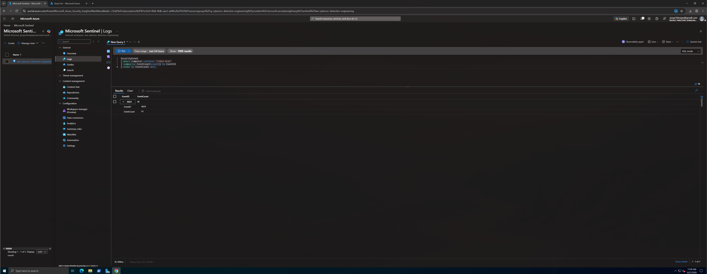
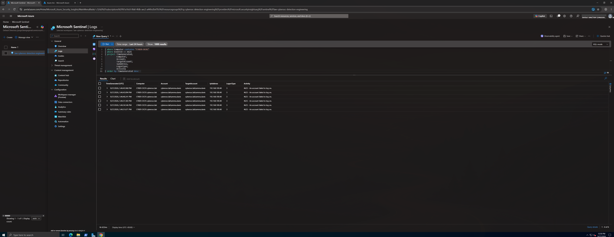
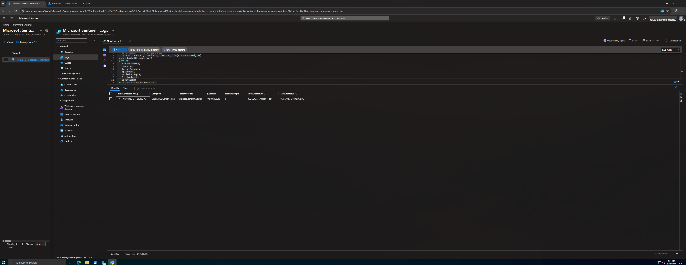
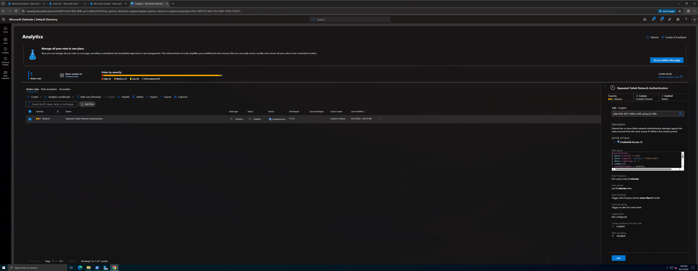
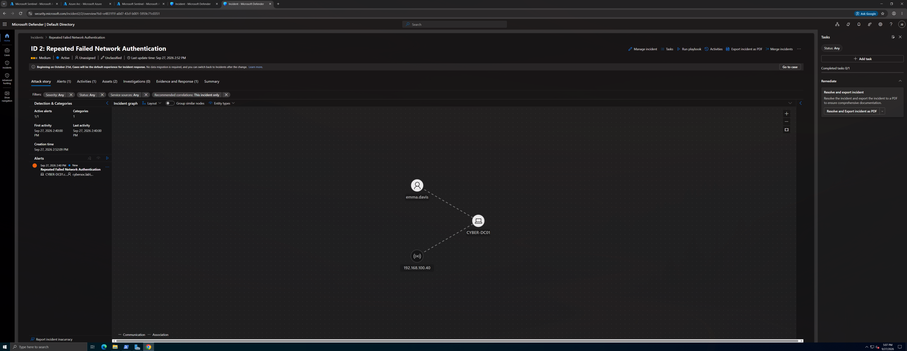
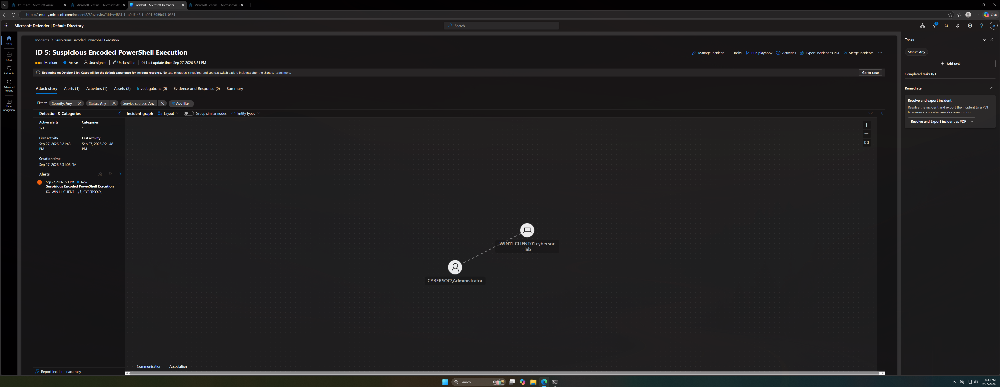
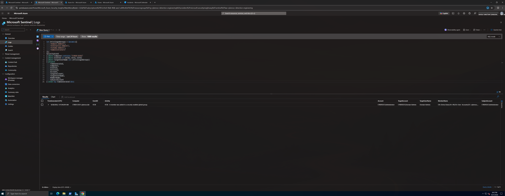
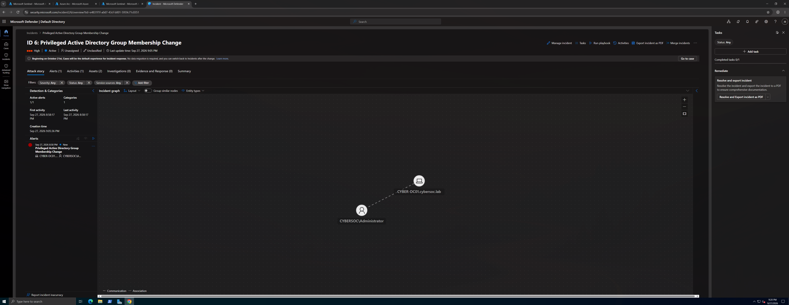

## Overview

This project focuses on building, validating, tuning, and operationalizing security detections using Microsoft Sentinel and Kusto Query Language (KQL).

The goal was not simply to ingest logs into a SIEM. The objective was to approach each scenario as a detection engineering problem:

**Threat Behavior → Detection Hypothesis → Telemetry → KQL → Validation → Tuning → Analytics Rule → Incident**

Three detections were developed against activity generated inside the CyberSOC home lab:

1. Repeated failed network authentication attempts
2. Suspicious encoded PowerShell execution
3. Privileged Active Directory group membership changes

Windows security telemetry from the isolated VMware lab was temporarily forwarded to Microsoft Sentinel using Azure Arc, Azure Monitor Agent, a Data Collection Rule, and a Log Analytics workspace.

Each detection was tested using controlled activity, validated against the underlying Windows telemetry, tuned to reduce false positives or operational issues, converted into a scheduled Microsoft Sentinel analytics rule, and finally validated through generated Microsoft Defender incidents.

After validation and evidence collection were complete, the Azure infrastructure and locally installed Azure components were removed, returning the CyberSOC environment to its isolated state.

---

## Project Objectives

The objectives of this project were to:

- Build behavioral detections using Microsoft Sentinel and KQL
- Develop detection hypotheses before writing detection logic
- Identify the Windows telemetry required for each detection
- Generate controlled security events inside the CyberSOC lab
- Validate detection logic against real telemetry
- Tune detections to reduce false positives
- Account for telemetry ingestion latency
- Convert validated KQL into scheduled Sentinel analytics rules
- Map detections to MITRE ATT&CK
- Generate and investigate Microsoft Defender incidents
- Maintain a temporary cloud footprint and remove Azure resources after validation

---

## Detection Engineering Methodology

Each detection followed the same engineering lifecycle:

```text
Threat Behavior
      ↓
Detection Hypothesis
      ↓
Telemetry Requirement
      ↓
Baseline Analysis
      ↓
Controlled Activity
      ↓
KQL Detection Logic
      ↓
Positive / Negative Validation
      ↓
False Positive Analysis
      ↓
Detection Tuning
      ↓
Sentinel Analytics Rule
      ↓
Microsoft Defender Incident
      ↓
MITRE ATT&CK Mapping
```

This methodology separates detection engineering from simple log searching.

A query returning an event does not necessarily represent a reliable detection. The detection must also identify the intended behavior, suppress expected activity where appropriate, operate correctly with ingestion latency, and produce actionable alerts.

---

# Lab Architecture

The CyberSOC environment runs locally in VMware Workstation using an isolated host only network.

```text
                    CyberSOC VMware Lab
                    VMnet2 - 192.168.100.0/24
                              │
              ┌───────────────┴───────────────┐
              │                               │
       CYBER-DC01                      WIN11-CLIENT01
       192.168.100.10                  192.168.100.20
       Windows Server 2022             Windows 11 Enterprise
       Active Directory                Domain Workstation
       DNS                             Process Auditing
              │                               │
              └───────────────┬───────────────┘
                              │
                       Windows Security
                            Events
                              │
                              ▼
                          Azure Arc
                              │
                              ▼
                    Azure Monitor Agent
                              │
                              ▼
                    Data Collection Rule
                              │
                              ▼
                   Log Analytics Workspace
                              │
                              ▼
                     Microsoft Sentinel
                              │
                              ▼
                             KQL
                              │
                              ▼
                    Scheduled Analytics
                           Rules
                              │
                              ▼
                     Microsoft Defender
                          Incidents
```

A temporary VMware NAT adapter was added to the Windows systems only while Azure connectivity was required. The original VMnet2 interfaces remained in place throughout the project.

The NAT adapters were removed after the project was completed.

---

## Systems Used

| System | IP Address | Role |
|---|---|---|
| CYBER-DC01 | 192.168.100.10 | Active Directory Domain Controller / DNS |
| WIN11-CLIENT01 | 192.168.100.20 | Domain joined Windows 11 workstation |
| KALI-ATTACKER01 | 192.168.100.40 | Controlled security testing system |

Domain:

```text
cybersoc.lab
```

---

# Microsoft Sentinel Deployment

A temporary Azure environment was created specifically for the project.

Resource group:

```text
rg-cybersoc-detection-engineering
```

Log Analytics workspace:

```text
law-cybersoc-detection-engineering
```

Data Collection Rule:

```text
dcr-cybersoc-security-events
```

Both Windows systems were onboarded to Azure Arc and configured with Azure Monitor Agent.

The Data Collection Rule collected the Windows Security Events required by the detection scenarios and forwarded them to the Log Analytics workspace used by Microsoft Sentinel.

Telemetry was queried through the `SecurityEvent` table.

---

## Validating Security Event Ingestion

Before developing any detections, I verified that Windows Security telemetry from `CYBER-DC01` was successfully reaching Microsoft Sentinel.

```kusto
SecurityEvent
| where Computer contains "CYBER-DC01"
| summarize EventCount=count() by EventID
| order by EventCount desc
```

The query returned Windows Security events from the domain controller, confirming the telemetry pipeline:

```text
CYBER-DC01
    ↓
Windows Security Log
    ↓
Azure Monitor Agent
    ↓
Data Collection Rule
    ↓
Log Analytics
    ↓
Microsoft Sentinel
    ↓
SecurityEvent
```



With telemetry successfully reaching Sentinel, detection development could begin.

---

# Detection 01: Repeated Failed Network Authentication

## Detection Hypothesis

Five or more failed network authentication attempts for the same account from the same source IP within a five minute period may represent password guessing activity and should generate an alert for investigation.

### MITRE ATT&CK

**T1110 — Brute Force**

### Telemetry

Windows Security Event:

```text
4625 - An account failed to log on
```

For SMB authentication, the expected logon type was:

```text
LogonType 3 - Network
```

---

## Establishing a Baseline

Before generating test activity, I searched for existing failed authentication events.

```kusto
SecurityEvent
| where Computer contains "CYBER-DC01"
| where EventID == 4625
| project
    TimeGenerated,
    Computer,
    Account,
    TargetAccount,
    IpAddress,
    LogonType,
    Activity
| order by TimeGenerated desc
```

The baseline returned no matching events.

This established a clean starting point before generating controlled authentication failures.

---

## Controlled Authentication Failures

From `KALI-ATTACKER01`, six failed SMB authentication attempts were generated against the domain controller using the existing lab account `emma.davis` and an intentionally incorrect password.

```bash
for i in {1..6}; do
    nxc smb 192.168.100.10 \
        -d cybersoc.lab \
        -u emma.davis \
        -p 'CyberSOC-WrongPassword!'
    sleep 2
done
```

Sentinel subsequently received six Event ID `4625` records containing:

```text
TargetAccount: cybersoc.lab\emma.davis
IpAddress:     192.168.100.40
LogonType:     3
Computer:      CYBER-DC01.cybersoc.lab
```



This confirmed that the telemetry contained the account, source IP, logon type, and destination system required by the detection hypothesis.

---

## Detection Logic

The initial threshold detection grouped failed authentication attempts by account, source IP, computer, and five minute time bucket.

```kusto
SecurityEvent
| where EventID == 4625
| where Computer contains "CYBER-DC01"
| where LogonType == 3
| summarize
    FailedAttempts = count(),
    FirstAttempt = min(TimeGenerated),
    LastAttempt = max(TimeGenerated)
    by TargetAccount, IpAddress, Computer, bin(TimeGenerated, 5m)
| where FailedAttempts >= 5
| project
    TimeGenerated,
    Computer,
    TargetAccount,
    IpAddress,
    FailedAttempts,
    FirstAttempt,
    LastAttempt
| order by TimeGenerated desc
```

The six controlled failures generated one detection result.



The `LogonType == 3` condition restricts the detection to network authentication activity and avoids treating unrelated interactive authentication failures as part of the same behavior.

---

## Negative Control

Threshold behavior was tested by generating fewer failed authentication attempts.

The detection produced the expected behavior:

```text
6 failed attempts → Detected
3 failed attempts → Filtered
1 failed attempt  → Filtered
```

This confirmed that isolated authentication failures did not automatically generate the detection.

---

## Ingestion Latency

During testing, Windows events did not arrive in Sentinel immediately.

Observed ingestion delays were approximately:

```text
3 minutes 48 seconds
to
5 minutes 05 seconds
```

This exposed an operational issue.

A rule running every five minutes while looking back only five minutes could execute before the relevant events had reached Sentinel.

Increasing the lookback period solved that problem but introduced another issue: the same event set could be evaluated during multiple rule executions, producing duplicate incidents.

The final detection therefore used both event time and ingestion time.

---

## Final Production Query

```kusto
let ingestion_delay = 6m;
let rule_frequency = 5m;
SecurityEvent
| where TimeGenerated >= ago(ingestion_delay + rule_frequency)
| where ingestion_time() > ago(rule_frequency)
| where EventID == 4625
| where Computer contains "CYBER-DC01"
| where LogonType == 3
| summarize
    FailedAttempts = count(),
    FirstAttempt = min(TimeGenerated),
    LastAttempt = max(TimeGenerated)
    by TargetAccount, IpAddress, Computer, bin(TimeGenerated, 5m)
| where FailedAttempts >= 5
| project
    TimeGenerated,
    Computer,
    TargetAccount,
    IpAddress,
    FailedAttempts,
    FirstAttempt,
    LastAttempt
```

The rule executes every five minutes while examining an eleven minute event time window.

The additional condition:

```kusto
ingestion_time() > ago(rule_frequency)
```

limits each execution to telemetry newly ingested during the current rule interval.

This allowed the rule to tolerate delayed ingestion without repeatedly alerting on the same previously ingested events.

> The `bin(TimeGenerated, 5m)` operation uses fixed five minute clock aligned buckets. It should not be interpreted as a continuously sliding five minute window.

---

## Sentinel Analytics Rule

The detection was operationalized as a scheduled Microsoft Sentinel analytics rule.

Configuration:

```text
Name:       Repeated Failed Network Authentication
Severity:   Medium
Frequency:  5 minutes
Lookback:   11 minutes
Threshold:  Greater than 0
```



Fresh controlled authentication failures were generated after the rule was enabled.

Microsoft Sentinel generated an alert and Microsoft Defender created an incident.

The incident correlated:

```text
Account: CYBERSOC\emma.davis
Host:    CYBER-DC01
IP:      192.168.100.40
```



The final validation produced one incident without a duplicate during subsequent rule executions.

---

# Detection 02: Suspicious Encoded PowerShell Execution

## Detection Hypothesis

PowerShell execution containing encoded command line arguments may indicate command obfuscation or an attempt to conceal script contents and should generate an alert for investigation.

### MITRE ATT&CK

**T1059.001 — Command and Scripting Interpreter: PowerShell**

### Telemetry

Windows Security Event:

```text
4688 - A new process has been created
```

---

## Enabling Process Command Line Auditing

Process creation auditing was already enabled on `WIN11-CLIENT01`, but command line information was initially unavailable.

Command line auditing was enabled using:

```powershell
reg add "HKLM\Software\Microsoft\Windows\CurrentVersion\Policies\System\Audit" `
    /v ProcessCreationIncludeCmdLine_Enabled `
    /t REG_DWORD `
    /d 1 `
    /f

gpupdate /force
```

The registry value was verified as:

```text
REG_DWORD 0x1
```

A controlled PowerShell process was then executed and Event ID `4688` confirmed that full command line arguments were being captured.

---

## PowerShell Telemetry Baseline

The following query identified PowerShell process creation events:

```kusto
SecurityEvent
| where Computer contains "WIN11-CLIENT01"
| where EventID == 4688
| where NewProcessName endswith @"\powershell.exe"
| project
    TimeGenerated,
    Computer,
    Account,
    NewProcessName,
    CommandLine,
    ParentProcessName
| order by TimeGenerated desc
```

The Windows 11 client was successfully forwarding Event ID `4688` telemetry to Sentinel.

---

## Initial Encoded PowerShell Detection

The first detection searched for encoded PowerShell command line arguments.

```kusto
SecurityEvent
| where Computer contains "WIN11-CLIENT01"
| where EventID == 4688
| where NewProcessName endswith @"\powershell.exe"
| where CommandLine has_any ("-EncodedCommand", "-enc")
| project
    TimeGenerated,
    Computer,
    Account,
    NewProcessName,
    CommandLine,
    ParentProcessName
| order by TimeGenerated desc
```

Unexpectedly, the baseline query returned encoded PowerShell activity before any controlled test had been generated.

Investigation showed the parent process originated from:

```text
AzureConnectedMachineAgent\GCArcService
```

The Azure Arc management service legitimately used encoded PowerShell as part of its management operations.

This represented a real false positive discovered during baseline analysis.

---

## False Positive Tuning

Rather than excluding PowerShell broadly or excluding an entire account, the detection was tuned around the specific known parent process responsible for the expected activity.

```kusto
SecurityEvent
| where Computer contains "WIN11-CLIENT01"
| where EventID == 4688
| where NewProcessName endswith @"\powershell.exe"
| where CommandLine has_any ("-EncodedCommand", "-enc")
| where ParentProcessName !contains @"AzureConnectedMachineAgent\GCArcService"
| project
    TimeGenerated,
    Computer,
    Account,
    NewProcessName,
    CommandLine,
    ParentProcessName
| order by TimeGenerated desc
```

After the exclusion was applied, the known Azure Arc activity no longer matched the detection.

The exclusion remained intentionally narrow so that other encoded PowerShell activity would continue to be detected.

---

## Controlled Encoded PowerShell Execution

A benign encoded PowerShell command was generated on `WIN11-CLIENT01`.

```powershell
$command = "Write-Output 'CyberSOC Detection Engineering Encoded PowerShell Test'"
$bytes = [System.Text.Encoding]::Unicode.GetBytes($command)
$encoded = [Convert]::ToBase64String($bytes)

powershell.exe -NoProfile -EncodedCommand $encoded
```

The tuned query detected the controlled PowerShell execution while continuing to exclude the known Azure Arc activity.

This demonstrated:

```text
Known Azure Arc encoded PowerShell → Filtered
Controlled encoded PowerShell      → Detected
```

---

## Final Analytics Query

The ingestion time logic developed during Detection 01 was incorporated into the final rule.

```kusto
let ingestion_delay = 6m;
let rule_frequency = 5m;
SecurityEvent
| where TimeGenerated >= ago(ingestion_delay + rule_frequency)
| where ingestion_time() > ago(rule_frequency)
| where Computer contains "WIN11-CLIENT01"
| where EventID == 4688
| where NewProcessName endswith @"\powershell.exe"
| where CommandLine has_any ("-EncodedCommand", "-enc")
| where ParentProcessName !contains @"AzureConnectedMachineAgent\GCArcService"
| project
    TimeGenerated,
    Computer,
    Account,
    NewProcessName,
    CommandLine,
    ParentProcessName
```

Analytics rule configuration:

```text
Name:       Suspicious Encoded PowerShell Execution
Severity:   Medium
Frequency:  5 minutes
Lookback:   11 minutes
Threshold:  Greater than 0
```

A fresh encoded PowerShell execution was generated after the analytics rule was enabled.

Microsoft Defender subsequently created:

```text
Suspicious Encoded PowerShell Execution
```

The incident correlated the executing account with the Windows 11 endpoint.



This detection demonstrates why baseline analysis is important during detection engineering. A simple encoded PowerShell rule would have treated legitimate Azure Arc activity as suspicious. Examining the process ancestry allowed the detection to be tuned without broadly suppressing PowerShell visibility.

---

# Detection 03: Privileged Active Directory Group Membership Change

## Detection Hypothesis

Addition of an account to a privileged Active Directory security group may indicate unauthorized privilege escalation or persistence and should generate an alert for investigation.

### MITRE ATT&CK

**T1098.007 — Account Manipulation: Additional Local or Domain Groups**

Tactics:

```text
Persistence
Privilege Escalation
```

### Telemetry

Windows Security events:

```text
4728 - Member added to a security enabled global group
4732 - Member added to a security enabled local group
4756 - Member added to a security enabled universal group
```

---

## Baseline

The domain controller was queried for existing group addition events.

```kusto
SecurityEvent
| where Computer contains "CYBER-DC01"
| where EventID in (4728, 4732, 4756)
| project
    TimeGenerated,
    Computer,
    EventID,
    Activity,
    Account,
    TargetAccount,
    MemberName
| order by TimeGenerated desc
```

The baseline returned no matching events.

---

## Controlled Privilege Change

The existing domain user:

```text
emma.davis
```

was first verified not to be a member of `Domain Admins`.

The account was then temporarily added to the privileged group:

```powershell
Add-ADGroupMember `
    -Identity "Domain Admins" `
    -Members "emma.davis"
```

Membership was verified with:

```powershell
Get-ADGroupMember "Domain Admins" |
    Where-Object SamAccountName -eq "emma.davis"
```

Sentinel received Event ID `4728`.

The event identified:

```text
Actor:          CYBERSOC\Administrator
Target Group:   CYBERSOC\Domain Admins
Added Member:   Emma Davis
Computer:       CYBER-DC01
Event ID:       4728
```

---

## Detection Tuning

Alerting on every group membership change would generate unnecessary noise in an enterprise environment.

The detection was therefore scoped to high value groups:

```kusto
let PrivilegedGroups = dynamic([
    "Domain Admins",
    "Enterprise Admins",
    "Schema Admins",
    "Administrators"
]);
SecurityEvent
| where Computer contains "CYBER-DC01"
| where EventID in (4728, 4732, 4756)
| where TargetUserName in~ (PrivilegedGroups)
| project
    TimeGenerated,
    Computer,
    EventID,
    Activity,
    Account,
    TargetAccount,
    TargetUserName,
    MemberName,
    SubjectAccount
| order by TimeGenerated desc
```

The controlled addition to `Domain Admins` matched the tuned detection.



This approach focuses analyst attention on group changes capable of materially increasing account privileges rather than treating ordinary group administration as equivalent risk.

---

## Final Analytics Query

The production rule incorporated the same ingestion delay handling used by the previous detections.

```kusto
let ingestion_delay = 6m;
let rule_frequency = 5m;
let PrivilegedGroups = dynamic([
    "Domain Admins",
    "Enterprise Admins",
    "Schema Admins",
    "Administrators"
]);
SecurityEvent
| where TimeGenerated >= ago(ingestion_delay + rule_frequency)
| where ingestion_time() > ago(rule_frequency)
| where Computer contains "CYBER-DC01"
| where EventID in (4728, 4732, 4756)
| where TargetUserName in~ (PrivilegedGroups)
| project
    TimeGenerated,
    Computer,
    EventID,
    Activity,
    Account,
    TargetAccount,
    TargetUserName,
    MemberName,
    SubjectAccount
```

Analytics rule configuration:

```text
Name:       Privileged Active Directory Group Membership Change
Severity:   High
Frequency:  5 minutes
Lookback:   11 minutes
Threshold:  Greater than 0
```

A fresh addition to `Domain Admins` was generated after the rule was enabled.

Microsoft Defender created a **High severity** incident:

```text
Privileged Active Directory Group Membership Change
```

The incident graph correlated:

```text
CYBERSOC\Administrator
          │
          ▼
CYBER-DC01.cybersoc.lab
```



After validation, `emma.davis` was immediately removed from `Domain Admins`.

Membership was verified again and returned no result, confirming that the temporary privilege change had been reverted.

---

# Detection Summary

| Detection | Primary Event | Detection Type | Severity | MITRE ATT&CK |
|---|---:|---|---|---|
| Repeated Failed Network Authentication | 4625 | Threshold / Authentication | Medium | T1110 |
| Suspicious Encoded PowerShell Execution | 4688 | Process / Command Line | Medium | T1059.001 |
| Privileged AD Group Membership Change | 4728 / 4732 / 4756 | Identity / Privilege Change | High | T1098.007 |

The three detections intentionally cover different security domains:

```text
Authentication
     ↓
Repeated Failed Network Authentication

Endpoint Execution
     ↓
Suspicious Encoded PowerShell

Identity / Active Directory
     ↓
Privileged Group Membership Change
```

---

# Detection Engineering Lessons

## 1. Start With a Hypothesis

Writing KQL before defining suspicious behavior can result in queries that return interesting events without representing a meaningful detection.

Each detection in this project began with a behavioral hypothesis that could be tested.

---

## 2. Baselines Reveal False Positives

The encoded PowerShell scenario demonstrated this directly.

Before controlled activity was generated, the initial detection already returned events. Investigation showed that Azure Arc legitimately executed encoded PowerShell through `GCArcService`.

Without baseline analysis, the detection would have been operationalized with a known false positive.

---

## 3. Tune Narrowly

The encoded PowerShell detection did not exclude:

```text
Administrator
```

and did not exclude:

```text
powershell.exe
```

Instead, it excluded the specific known Azure Arc parent process path.

Narrow exclusions preserve detection coverage while suppressing known expected behavior.

---

## 4. Ingestion Latency Affects Detection Design

A scheduled query can be logically correct and still fail operationally if the telemetry has not arrived before the rule executes.

The project measured real ingestion latency and adjusted the rule window accordingly.

The combination of:

```kusto
TimeGenerated
```

and:

```kusto
ingestion_time()
```

allowed delayed events to be evaluated while reducing duplicate alerts.

---

## 5. Positive and Negative Controls Matter

Detection validation should establish both:

```text
Activity that SHOULD trigger → Detected
Activity that SHOULD NOT trigger → Filtered
```

Detection 01 validated its threshold using failed authentication counts below and above the threshold.

Detection 02 validated both known Azure Arc encoded PowerShell and controlled encoded PowerShell.

Detection 03 scoped ordinary group administration to a defined set of privileged groups.

---

## 6. Detection Logic Is Only Part of the Pipeline

A working KQL query is not the final product.

The complete path validated during this project was:

```text
Windows Activity
      ↓
Security Event
      ↓
Telemetry Collection
      ↓
Microsoft Sentinel
      ↓
KQL Detection
      ↓
Scheduled Analytics Rule
      ↓
Alert
      ↓
Microsoft Defender Incident
      ↓
Entity Correlation
```

The final incident provides the analyst facing output of the engineering process.

---

# Azure Teardown and Cost Control

The Azure infrastructure used for this project was intentionally temporary.

Once all three detections had been validated and evidence had been captured, the environment was dismantled.

The teardown sequence was:

```text
1. Remove Azure Monitor Agent extensions
            ↓
2. Disconnect CYBER-DC01 from Azure Arc
            ↓
3. Disconnect WIN11-CLIENT01 from Azure Arc
            ↓
4. Uninstall Azure Connected Machine Agent
            ↓
5. Verify local Arc services and commands are removed
            ↓
6. Delete rg-cybersoc-detection-engineering
            ↓
7. Remove temporary VMnet8 NAT adapters
            ↓
8. Return lab systems to isolated VMnet2 networking
```

Before deletion, the remaining resource group contained only the resources created for this project:

```text
dcr-cybersoc-security-events
law-cybersoc-detection-engineering
SecurityInsights(law-cybersoc-detection-engineering)
```

The complete resource group was then deleted.

Both local systems were returned to the isolated CyberSOC network.

This approach allowed Microsoft Sentinel to be used for realistic cloud based detection engineering without permanently moving the home lab into Azure.

---

# Tools and Technologies

| Technology | Purpose |
|---|---|
| Microsoft Sentinel | SIEM and analytics rule platform |
| Microsoft Defender | Incident investigation and entity correlation |
| Kusto Query Language | Detection logic and telemetry analysis |
| Log Analytics | Security event storage and querying |
| Azure Monitor Agent | Windows telemetry collection |
| Data Collection Rules | Telemetry collection configuration |
| Azure Arc | Connecting local VMware systems to Azure |
| Windows Security Auditing | Authentication, process, and account change telemetry |
| Active Directory | Identity and privileged group testing |
| PowerShell | Controlled activity and system configuration |
| NetExec | Controlled SMB authentication testing |
| VMware Workstation | Local CyberSOC virtualization platform |

---

# Skills Demonstrated

This project demonstrates practical experience with:

- Detection engineering methodology
- Microsoft Sentinel
- Kusto Query Language
- Microsoft Defender incident investigation
- Windows Security Event analysis
- Active Directory security monitoring
- Process creation telemetry
- Authentication telemetry
- Identity and privilege change monitoring
- False positive investigation
- Detection tuning
- Threshold based analytics
- Ingestion latency analysis
- Scheduled analytics rules
- Entity mapping and incident correlation
- MITRE ATT&CK mapping
- Azure Arc
- Azure Monitor Agent
- Log Analytics
- Data Collection Rules
- Controlled security testing
- Cloud resource lifecycle management
- Security lab cost control

---

# Evidence

| Evidence | Description |
|---|---|
| `01-Sentinel-Security-Event-Ingestion.png` | Initial validation of Windows Security telemetry reaching Sentinel |
| `02-Failed-Authentication-Telemetry.png` | Controlled Event ID 4625 authentication failures |
| `03-Failed-Authentication-Detection-KQL.png` | Threshold based failed authentication detection |
| `04-Failed-Authentication-Analytics-Rule.png` | Sentinel scheduled analytics rule |
| `05-Failed-Authentication-Incident.png` | Defender incident generated by Detection 01 |
| `06-Encoded-PowerShell-Incident.png` | Defender incident generated by Detection 02 |
| `07-Privileged-Group-Detection-KQL.png` | Tuned privileged group KQL detection |
| `08-Privileged-Group-Incident.png` | High severity Defender incident generated by Detection 03 |

---

# Key Takeaways

This project moved beyond simply searching SIEM logs and focused on the engineering decisions required to make detections operational.

The most important lessons were:

- Define suspicious behavior before writing detection logic.
- Understand the telemetry behind the detection.
- Establish a baseline before generating test activity.
- Treat unexpected matches as opportunities to investigate false positives.
- Prefer narrow exclusions over broad allowlisting.
- Validate both positive and negative conditions.
- Measure ingestion behavior instead of assuming telemetry arrives immediately.
- Design scheduled rules around real ingestion characteristics.
- Validate the entire path from endpoint activity to analyst facing incident.
- Map detections to attacker behavior using MITRE ATT&CK.
- Remove temporary cloud infrastructure when it is no longer required.

The resulting detections covered authentication abuse, suspicious endpoint execution, and Active Directory privilege modification while using the same repeatable detection engineering methodology across all three scenarios.

---

## Portfolio Context

This repository is part of the larger **CyberSOC Portfolio**, a multi project cybersecurity home lab designed to demonstrate practical experience across:

- Enterprise Windows and Active Directory infrastructure
- Attack simulation and detection
- Vulnerability management
- SIEM operations
- Detection engineering
- Incident response

This project specifically focuses on **Detection Engineering with Microsoft Sentinel and KQL**.
